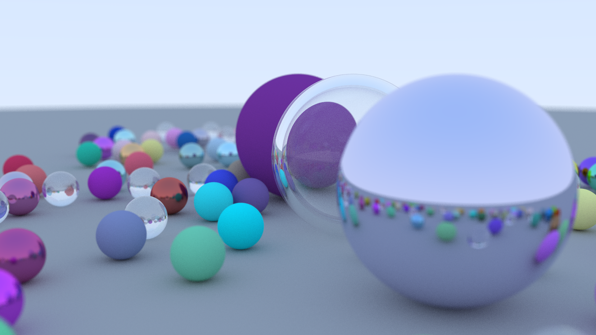

# Raysen : 

## What is this ?
This is an implementation in Rust of a ray-tracer following (for the moment) the tutorial : 

[_https://github.com/RayTracing/raytracing.github.io_](https://github.com/RayTracing/raytracing.github.io)

## How to use it ?
The simplest way to use the render is to execute the script `run.sh` wich will produce a .png of the result.

Otherwise the render output the resulting image on the stdout, in the ppm format. The progress status is outputed on the stderr. 

## Showcase :
Most the first book is implemented. Here is a image the motor rendered : 

## Where this is going ?
This is the begining of a bigger project to make a ray-tracing renderer in Rust with GPU acceleration using WebGPU.

